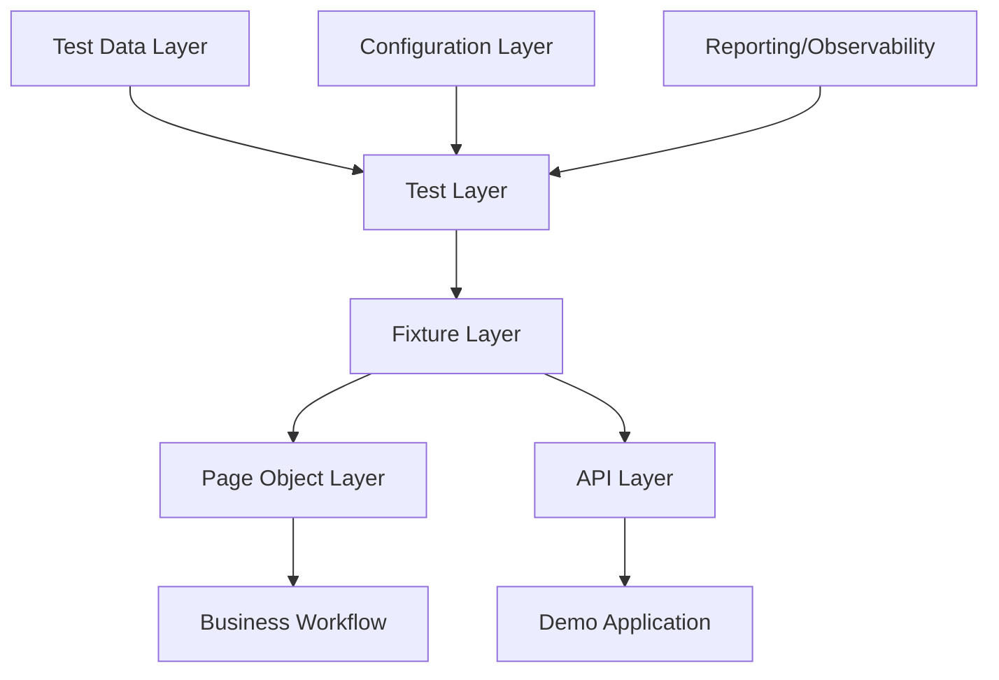

# Architecture

## Layer responsibilities

### Test Layer
Tests remain focused on business intent, not on low-level mechanics. They use fixtures and page objects to express actions in a readable way.

### Business Layer
Business workflows sit above page objects and provide domain-specific actions such as login, create product, and create user.

### Page Layer
Page objects encapsulate selectors and user actions so UI tests remain maintainable and stable.

### API Layer
The API client layer is used for REST validation, creating data, and faster test setup.

### Fixture Layer
Fixtures provide reusable setup, authentication, and lifecycle management for contexts and pages.

### Data Layer
Test data is generated or static and intentionally isolated from test logic.

### Configuration Layer
Environment configuration keeps the framework portable across local, CI, and containerized runs.

### Reporting Layer
HTML reports, traces, screenshots, and videos help diagnose and triage failures quickly.
