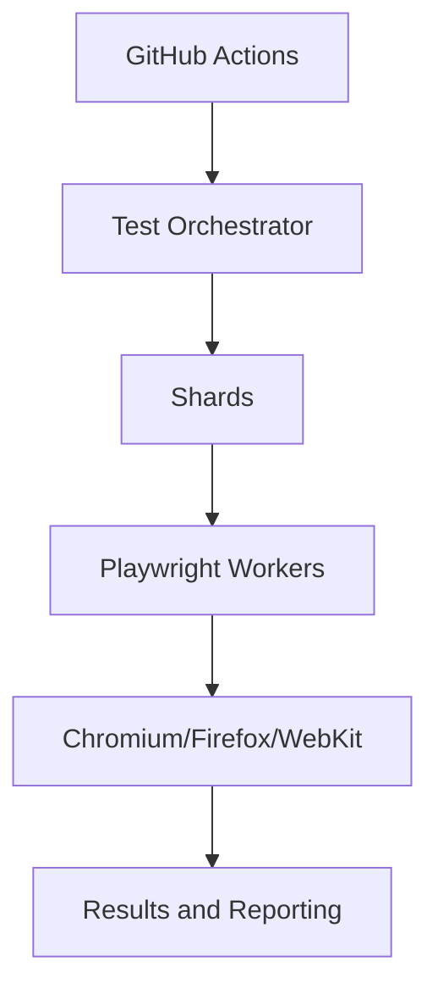

# Scaling Strategy

The framework is designed to scale from a few tests to thousands without a rewrite.

## Growth model

- 10 tests: local execution with a single browser project
- 100 tests: multi-worker execution and selective tags
- 1,000 tests: sharded CI jobs and containerized execution
- 10,000 tests: cloud orchestration, Kubernetes jobs, central reporting

## Key principles

- Keep tests independent and isolated.
- Split smoke and regression suites.
- Prioritize API setup to reduce UI dependency.
- Use workers and sharding instead of one huge job.
- Centralize results for trend monitoring.

## Recommended execution model

## Horizontal scaling

For very large suites, run shards in parallel as separate jobs or Kubernetes Jobs. Each shard can use a specific browser profile and worker count. Results are merged into a central HTML and JSON report for aggregation.

## Resource guidance

- Local: 2-4 workers
- CI: 4-8 workers depending on runner class
- Containerized: tune based on CPU and memory limits
- Use test tags to prioritize smoke checks during fast feedback loops
